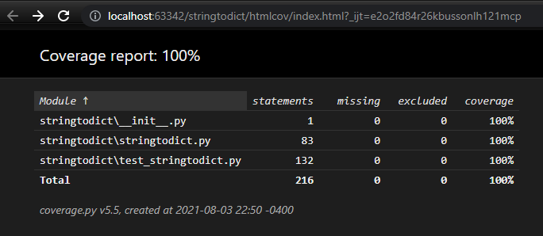

# Conversor de Texto em Dicionário de dados


1. Dado um `Schema`, um texto e o dicionário:

    ```python
        # Este exemplo de esquema serve tanto para serializar quanto desserializar 
        attribute_name = Attribute("name", Definition(6))
        attribute_address = Attribute("address", Definition(2))
        attribute_local = Attribute("local", Definition(1))
        attribute_value = Attribute("value", Definition(1))
        attribute_flag = Attribute("flag", Definition(1))
    
        schema_sub_nested = Schema("nested_sub", [attribute_flag])
        schema_nested = Schema("nested", [attribute_local, attribute_value, schema_sub_nested], 2)
        
        schema = Schema("root", [attribute_name, attribute_address, schema_nested, attribute_flag])
    ``` 
    
    ```python
    text = "ABCDEFGHIJKLMNO"
    ```
    
    ```python
    dictionary = {
                    'name': 'ABCDEF',
                    'address': 'GH',
                    'nested': [
                        {'local': 'I', 'value': 'J', 'nested_sub': {'flag': 'K'}},
                        {'local': 'L', 'value': 'M', 'nested_sub': {'flag': 'N'}}
                    ],
                    'flag': 'O',
                }
    ```
2. Para converter de texto em dicionário use:

    ```python
    result = StringToDict(schema).parse_string(text)
    ```
    O resultado será o dicionário.

3. Para converter um dicionário em texto use:
   
    ```python
    result = StringToDict(schema).parse_dict(dictionary)
    ```
    O resultado será o texto.
   
## Formatadores pré-definidos

Há alguns formatadores pré-definidos que podem ser usados para serializar e desserializar.

- Para serializar:

   ```python
   attribute_name = Attribute("name", Definition(4, "0", numerico_para_texto_formatters(4, 2)))
   attribute_address = Attribute("address", Definition(4, "0", numerico_para_texto_formatters(4, 2)))
   attribute_local = Attribute("local", Definition(6, " ", minuscula_formatters()))
   attribute_value = Attribute("value", Definition(5, "0", numerico_para_texto_formatters(5, 2)))
   attribute_flag = Attribute("flag", Definition(1, " "))

   schema_sub_nested = Schema("nested_sub", [attribute_flag])
   schema_nested = Schema("nested", [attribute_local, attribute_value, schema_sub_nested], 2)
   schema_serializador = Schema("root", [attribute_name, attribute_address, schema_nested, attribute_flag])
   ```
   
- Para desserializar:

   ```python
   attribute_name = Attribute("name", Definition(4, "0", texto_para_numerico_formatters(4, 2)))
   attribute_address = Attribute("address", Definition(4, "0", texto_para_numerico_formatters(4, 2)))
   attribute_local = Attribute("local", Definition(6, " ", minuscula_formatters()))
   attribute_value = Attribute("value", Definition(5, "0", texto_para_numerico_formatters(5, 2)))
   attribute_flag = Attribute("flag", Definition(1, " "))
   
   schema_sub_nested = Schema("nested_sub", [attribute_flag])
   schema_nested = Schema("nested", [attribute_local, attribute_value, schema_sub_nested], 2)
   schema_desserializador = Schema("root", [attribute_name, attribute_address, schema_nested, attribute_flag])
   ```
- Que convertem entre o texto e o dicionário:

   ````python
   text = "112345678901234567890123456789012"
  
   dictionary = {
      'name': 11.23,
      'address': 45.67,
      'nested': [
          {'local': '890123', 'value': 456.78, 'nested_sub': {'flag': '9'}},
          {'local': '012345', 'value': 678.9, 'nested_sub': {'flag': '1'}}
      ],
      'flag': '2',
   }
  
  result_text = StringToDict(schema_serializador).parse_dict(dictionary)
  result_dict = StringToDict(schema_desserializador).parse_string(text)
  # result_text == text
  # result_dict == dictionary
   ````
  
## Testes Unitários

Rodando os testes unitários com coverage (https://coverage.readthedocs.io/en/coverage-5.5/):

```bash
coverage run -m unittest discover
coverage report -m
coverage html
```



## Testes de Mutação

Rodando os testes de mutação com mutmut (https://github.com/boxed/mutmut):

```bash
mutmut run
mutmut show all
```